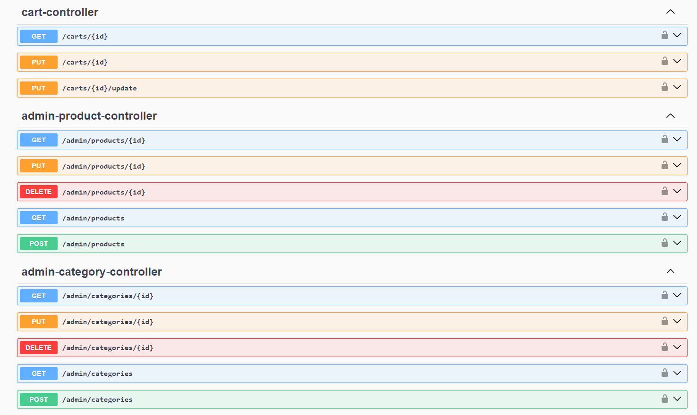
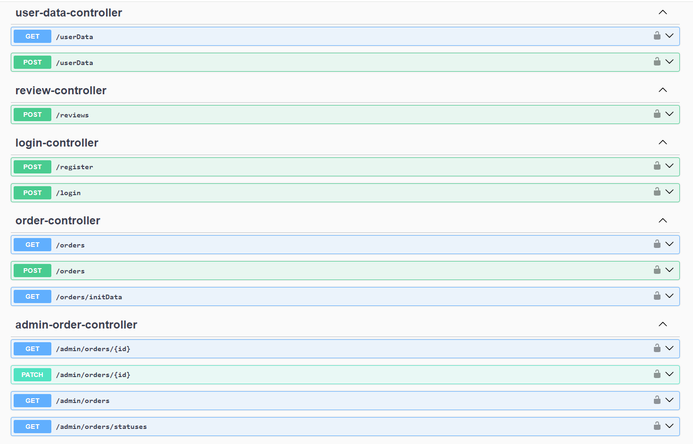
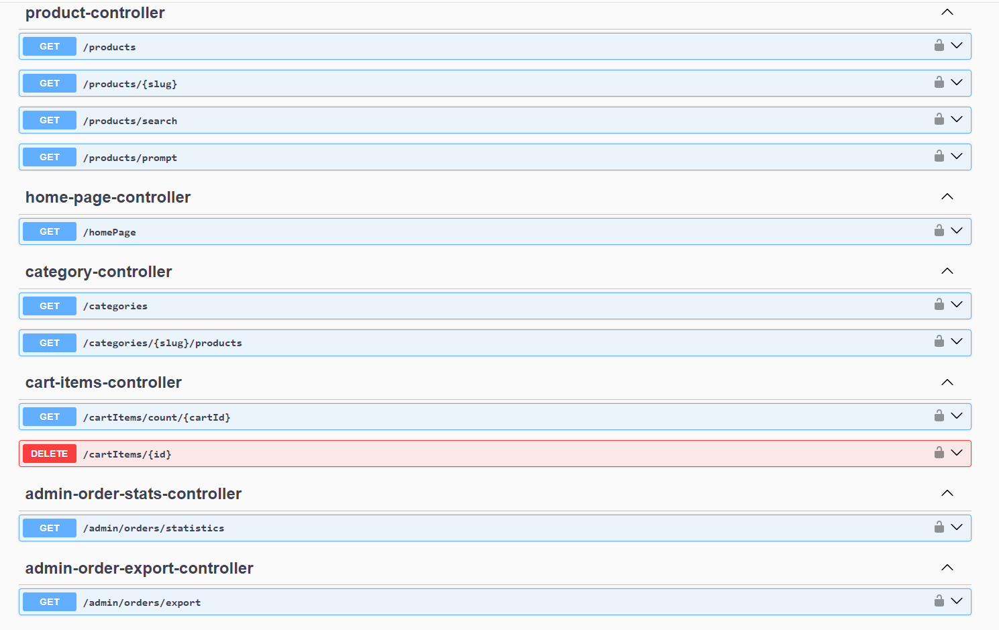

# ElecElite e-commerce electronics shop Backend part  

> See demo live [click here](https://elecelite.onrender.com/ "click to open link")  
> See frontend part: [Frontend Part](https://github.com/helter88/shopForntend "click to visit Github repository with frontend part")

## Functionalities of the ElecElite
- Registration
- Authorization by token
- Viewing products
- Viewing categories
- Searching products
- Admin panel for editing and adding products with images, categories,
- Scheduler to clean up orders from cart each day at 3:00 am
- Image compression
- Order service
- Send email with order confirmation
- Request validation
- deployment in cloud  
and more ...

## Tech

ElecElite is developed using following technologies:  

 &nbsp;
 &nbsp;
 &nbsp;
 &nbsp;
 &nbsp;
 &nbsp;

## Installation and run

### Requirements:
- Docker

### To run the application:
- write
``
mvn install
``
- To add database MySQL just run following command, and wait for containers to be pulled up and started.

``
docker compose up
``
- after write 
``
mvn spring-boot:run
``

## Rest-API Endpoints

Service url: [Swagger](https://shopbackend-4.onrender.com/swagger-ui/index.html "click to see swagger")

